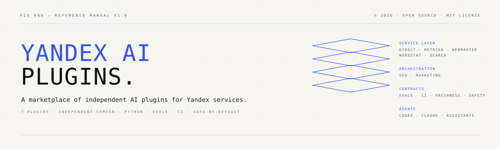
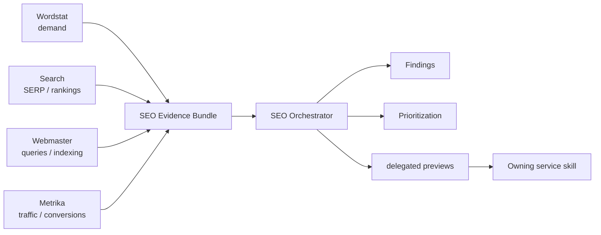
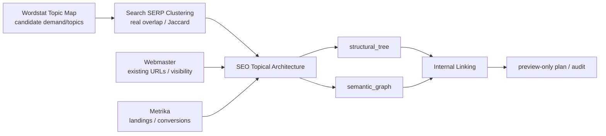
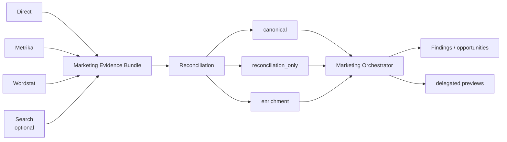

<p align="center"></p>

<p align="center"><a href="README.md">Русский</a> · <strong>English</strong></p>

<p align="center">   </p>

# Yandex AI Plugins

A marketplace monorepo of independent AI plugins for working with Yandex services from AI agents and coding assistants. A plugin is the installation/version boundary; a skill is the workflow/knowledge boundary; volatile API contracts stay in the owning service plugin.

> **Status:** Phases 1–7 are implemented. Patch release `PHASE 7 1.0.1` hardens the published semantic-cocoon baseline: Wordstat `1.1.1` rejects duplicate seed identifiers and candidate self-relations; SEO `1.1.1` isolates structural-node contracts from execution state and enforces list-typed link evidence. Search remains `1.0.2` and retains ownership of SERP-overlap clustering. Direct `1.0.1`, Metrika `1.0.2`, Webmaster `1.0.3`, and Marketing `1.1.0` are unchanged.

## Quick overview

| Plugin | Version | Type | Primary scope | Live writes? |
|---|---:|---|---|---|
| [`yandex-direct`](plugins/yandex-direct/) | 1.0.1 | service | campaigns, reports, audit, keywords, budgets | preview + explicit approval |
| [`yandex-metrika`](plugins/yandex-metrika/) | 1.0.2 | service | analytics, goals, attribution, Logs, imports | guarded writes |
| [`yandex-webmaster`](plugins/yandex-webmaster/) | 1.0.3 | service | indexing, queries, recrawl, sitemaps, feeds, exports | guarded writes |
| [`yandex-wordstat`](plugins/yandex-wordstat/) | 1.1.1 | service | demand, semantics, topic-map candidates, dynamics, regions | no consequential writes |
| [`yandex-search`](plugins/yandex-search/) | 1.0.2 | service | SERP, rankings, competitors, clustering | no |
| [`yandex-seo`](plugins/yandex-seo/) | 1.1.1 | cross-service | organic evidence, Topical Architecture, Internal Linking, orchestration | delegated preview only |
| [`yandex-marketing`](plugins/yandex-marketing/) | 1.1.0 | cross-service | paid acquisition and reconciliation | delegated preview only |

Details: [`docs/SERVICE_MATRIX.en.md`](docs/SERVICE_MATRIX.en.md) · [Русский](docs/SERVICE_MATRIX.md).

## Architecture

```text
service plugins                 cross-service orchestration
───────────────                 ───────────────────────────
yandex-direct ────────────────▶ yandex-marketing
yandex-metrika ───────┬───────▶ yandex-marketing
                      └───────▶ yandex-seo
yandex-wordstat ──────┬───────▶ yandex-marketing
                      └───────▶ yandex-seo
yandex-search ────────┬───────▶ yandex-marketing (optional context)
                      └───────▶ yandex-seo
yandex-webmaster ─────────────▶ yandex-seo
```

`yandex-seo` and `yandex-marketing` have no Yandex HTTP/API client or credential surface. They consume structured evidence/artifacts from service plugins, preserve provenance and limitations, derive findings, and delegate consequential action previews back to the owning service plugin.

Their `.agents` marketplace entries use `authentication: ON_USE` as schema-compatible deferred-auth metadata; this does not mean those transport-free plugins own credentials.

### Common safety lifecycle

```text
read → analyze → preview → explicit approval → write → verify
```

A recommendation is not permission to write. Draft creation is distinct from activation/publication.

## SEO orchestration



See [`plugins/yandex-seo/README.en.md`](plugins/yandex-seo/README.en.md).

### Phase 7: Semantic Cocoons / Topical Architecture / Internal Linking

Phase 7 does not turn Wordstat into a monolithic SEO-architecture tool. Ownership follows the evidence boundary:



- `yandex-wordstat-topic-map` → `wordstat-topic-map/v1`, candidate topics/relations only; Wordstat does not prove final page boundaries.
- `yandex-search-clustering` remains the owner of real SERP overlap; no competing fuzzy-text clusterer is added.
- `yandex-seo-topical-architecture` → `seo-topical-architecture/v1`, `GREENFIELD|EXISTING_SITE`, page decisions plus separate `structural_tree` and `semantic_graph`.
- `yandex-seo-internal-linking` → preview-only link plan/audit with no CMS writes.
- Claim classes `OBSERVED`, `DERIVED`, `HYPOTHESIS`, `METHODOLOGY` stay distinct; semantic-cocoon/TGA/QBST methodology is not represented as a verified ranking mechanism.
- Without Search evidence, `SERP_VALIDATION_MISSING` is mandatory and page boundaries remain hypotheses.
- Patch `1.0.1` does not change this architecture; it closes four post-release integrity findings in the Wordstat/SEO data contracts only.

## Marketing orchestration



Overlapping Direct/Metrika evidence is reconciled, never summed. See [`plugins/yandex-marketing/README.en.md`](plugins/yandex-marketing/README.en.md).

## Getting started

Marketplace metadata lives in `.agents/plugins/marketplace.json` and `.claude-plugin/marketplace.json`. Install only the plugins needed for a task.

```bash
cd plugins/yandex-marketing
python -m unittest discover -s tests -v
python -m py_compile scripts/marketing_prioritize.py
```

Repository verification:

```bash
python scripts/validate_repo.py
python -m unittest discover -s tests -v
```

Strict freshness is separate:

```bash
python scripts/check_reference_freshness.py
```

## Versions

```text
yandex-direct        1.0.1
yandex-metrika       1.0.2
yandex-webmaster     1.0.3
yandex-wordstat      1.1.1
yandex-search        1.0.2
yandex-seo           1.1.1
yandex-marketing     1.1.0
```

Plugins use independent SemVer. Repository milestones (`OPUS 1.1.0`, `DOCS 1.0.0`, `OPUS 1.1.1`, `PHASE 7 1.0.0`, `PHASE 7 1.0.1`) do not imply synchronized plugin bumps.

## Documentation

- [`docs/PLUGIN_STANDARD.en.md`](docs/PLUGIN_STANDARD.en.md) · [RU](docs/PLUGIN_STANDARD.md)
- [`docs/SERVICE_MATRIX.en.md`](docs/SERVICE_MATRIX.en.md) · [RU](docs/SERVICE_MATRIX.md)
- [`docs/ROADMAP.en.md`](docs/ROADMAP.en.md) · [RU](docs/ROADMAP.md)
- [`docs/CONTRACT_MATRIX.json`](docs/CONTRACT_MATRIX.json) — high-risk traceability index, not semantic proof
- [`docs/REVIEW_FIRST_RELEASE.en.md`](docs/REVIEW_FIRST_RELEASE.en.md) · [RU](docs/REVIEW_FIRST_RELEASE.md)
- [`CHANGELOG.en.md`](CHANGELOG.en.md) · [RU](CHANGELOG.md)

## License and sources

Project code and original documentation are MIT licensed. Official Yandex documentation is canonical for API behavior; donor repositories and external SEO material are methodology/workflow references, not substitutes for authoritative API/ranking evidence.
