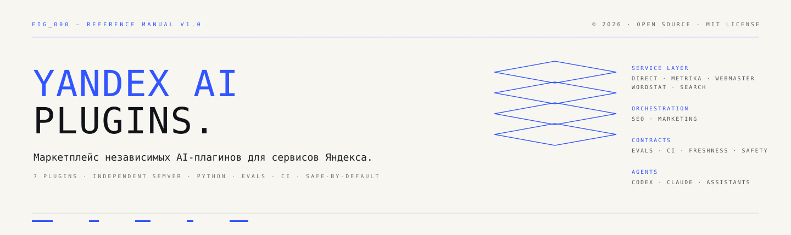
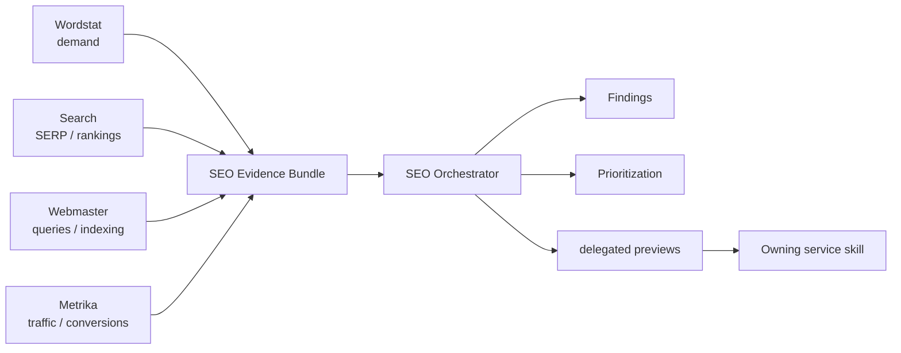
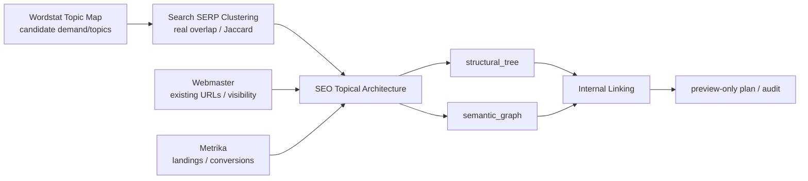
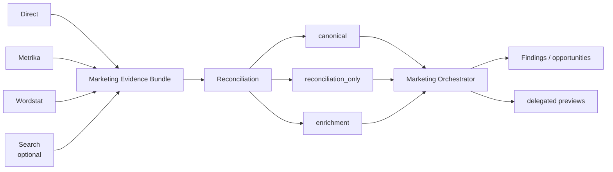

<p align="center"></p>

<p align="center"><strong>Русский</strong> · <a href="README.en.md">English</a></p>

<p align="center">   </p>

# Yandex AI Plugins

Репозиторий-маркетплейс независимых AI-плагинов для работы с сервисами Яндекса из AI-агентов и coding assistants. Плагин — граница установки и версии; skill — граница задачи и знаний; изменчивые API-контракты остаются внутри плагина-владельца.

> **Статус:** Phase 1–7 реализованы. Release `PHASE 7 1.0.0` добавляет candidate Topic Map в Wordstat `1.1.0` и Topical Architecture + Internal Linking в SEO `1.1.0`; Search остаётся `1.0.2` и сохраняет ownership SERP-overlap clustering. Direct `1.0.1`, Metrika `1.0.2`, Webmaster `1.0.3`, Marketing `1.1.0` не меняются.

## Быстрый обзор

| Plugin | Version | Type | Основная зона ответственности | Live writes? |
|---|---:|---|---|---|
| [`yandex-direct`](plugins/yandex-direct/) | 1.0.1 | service | кампании, отчёты, аудит, ключи, бюджеты | preview + explicit approval |
| [`yandex-metrika`](plugins/yandex-metrika/) | 1.0.2 | service | аналитика, цели, attribution, Logs, imports | guarded writes |
| [`yandex-webmaster`](plugins/yandex-webmaster/) | 1.0.3 | service | индексация, запросы, recrawl, sitemap, feeds, exports | guarded writes |
| [`yandex-wordstat`](plugins/yandex-wordstat/) | 1.1.0 | service | спрос, семантика, topic-map candidates, динамика, регионы | no consequential writes |
| [`yandex-search`](plugins/yandex-search/) | 1.0.2 | service | SERP, rankings, competitors, clustering | no |
| [`yandex-seo`](plugins/yandex-seo/) | 1.1.0 | cross-service | organic evidence, Topical Architecture, Internal Linking, orchestration | delegated preview only |
| [`yandex-marketing`](plugins/yandex-marketing/) | 1.1.0 | cross-service | paid acquisition и reconciliation | delegated preview only |

Подробности: [`docs/SERVICE_MATRIX.md`](docs/SERVICE_MATRIX.md) · [English](docs/SERVICE_MATRIX.en.md).

## Архитектура

```text
service plugins                 cross-service orchestration
───────────────                 ───────────────────────────
yandex-direct ────────────────▶ yandex-marketing
yandex-metrika ───────┬───────▶ yandex-marketing
                      └───────▶ yandex-seo
yandex-wordstat ──────┬───────▶ yandex-marketing
                      └───────▶ yandex-seo
yandex-search ────────┬───────▶ yandex-marketing (optional context)
                      └───────▶ yandex-seo
yandex-webmaster ─────────────▶ yandex-seo
```

`yandex-seo` и `yandex-marketing` не имеют собственных Yandex HTTP/API клиентов и credentials. Они принимают структурированные evidence/artifacts от сервисных плагинов, сохраняют provenance/limitations, строят findings и передают consequential действия обратно владельцу как delegated preview.

В `.agents` marketplace для этих transport-free cross-service plugins используется `authentication: ON_USE` как schema-compatible deferred-auth metadata; это не означает собственную credential surface.

### Общий safety lifecycle

```text
read → analyze → preview → explicit approval → write → verify
```

Рекомендация не является разрешением на запись. Создание draft не равно активации или публикации.

## Оркестрация SEO



Смысл схемы: SEO-композиция анализирует evidence, но transport и live mutations остаются у сервисных плагинов. Подробнее: [`plugins/yandex-seo/README.md`](plugins/yandex-seo/README.md).

### Phase 7: Semantic Cocoons / Topical Architecture / Internal Linking

Phase 7 не превращает Wordstat в «комбайн SEO-структуры». Ownership разделён по доказуемым данным:



- `yandex-wordstat-topic-map` → `wordstat-topic-map/v1`, только candidate topics/relations; Wordstat не доказывает финальные page boundaries.
- `yandex-search-clustering` остаётся владельцем реального SERP overlap; альтернативный fuzzy-text clusterer не вводится.
- `yandex-seo-topical-architecture` → `seo-topical-architecture/v1`, `GREENFIELD|EXISTING_SITE`, page decisions + отдельные `structural_tree` и `semantic_graph`.
- `yandex-seo-internal-linking` → preview-only link plan/audit без CMS writes.
- Claim classes `OBSERVED`, `DERIVED`, `HYPOTHESIS`, `METHODOLOGY` не смешиваются; semantic-cocoon/TGA/QBST methodology не объявляется подтверждённым ranking mechanism.
- Без Search evidence обязательно `SERP_VALIDATION_MISSING`; границы страниц остаются гипотезами.

## Оркестрация Marketing



Пересекающиеся Direct/Metrika показатели не складываются. Сначала определяется роль evidence, совместимость KPI/money context и canonical source. Подробнее: [`plugins/yandex-marketing/README.md`](plugins/yandex-marketing/README.md).

## Начало работы

Marketplace metadata:

```text
.agents/plugins/marketplace.json
.claude-plugin/marketplace.json
```

Устанавливайте только нужные плагины. Примеры: техническое SEO → Webmaster; спрос → Wordstat; SERP clustering → Search; полный organic-анализ → Wordstat + Search + Webmaster + Metrika + SEO; paid acquisition → Direct + релевантные Metrika/Wordstat источники + Marketing.

Bundled helpers можно запускать локально, когда runtime это позволяет. Например:

```bash
cd plugins/yandex-marketing
python -m unittest discover -s tests -v
python -m py_compile scripts/marketing_prioritize.py
```

Полная проверка репозитория:

```bash
python scripts/validate_repo.py
python -m unittest discover -s tests -v
```

Strict freshness отдельно:

```bash
python scripts/check_reference_freshness.py
```

## Версии

```text
yandex-direct        1.0.1
yandex-metrika       1.0.2
yandex-webmaster     1.0.3
yandex-wordstat      1.1.0
yandex-search        1.0.2
yandex-seo           1.1.0
yandex-marketing     1.1.0
```

Каждый plugin использует independent SemVer. Repository-level milestones (`OPUS 1.1.0`, `DOCS 1.0.0`, `OPUS 1.1.1`, `PHASE 7 1.0.0`) описывают согласованный набор изменений и не означают синхронного bump всех сервисов.

## Документация

- [`docs/PLUGIN_STANDARD.md`](docs/PLUGIN_STANDARD.md) — стандарт production plugin ([EN](docs/PLUGIN_STANDARD.en.md));
- [`docs/SERVICE_MATRIX.md`](docs/SERVICE_MATRIX.md) — фактически доступные сервисы ([EN](docs/SERVICE_MATRIX.en.md));
- [`docs/ROADMAP.md`](docs/ROADMAP.md) — выпущенные фазы и backlog ([EN](docs/ROADMAP.en.md));
- [`docs/CONTRACT_MATRIX.json`](docs/CONTRACT_MATRIX.json) — high-risk SKILL → helper → regression-test traceability index, не semantic proof;
- [`docs/REVIEW_FIRST_RELEASE.md`](docs/REVIEW_FIRST_RELEASE.md) — независимый review guide ([EN](docs/REVIEW_FIRST_RELEASE.en.md));
- [`CHANGELOG.md`](CHANGELOG.md) · [English changelog](CHANGELOG.en.md).

## Структура

```text
plugins/yandex-<service>/
├── .codex-plugin/plugin.json
├── .claude-plugin/plugin.json
├── skills/*/SKILL.md
├── references/
├── scripts/
├── tests/
├── evals/
├── README.md
├── README.en.md
├── CHANGELOG.md
└── CHANGELOG.en.md
```

## Лицензия и источники

Код и собственная документация проекта распространяются по MIT. Official Yandex documentation является источником истины для API behavior; donor repositories и внешние SEO-материалы используются как источники идей/methodology/workflow patterns, а не как замена authoritative API/ranking evidence.
