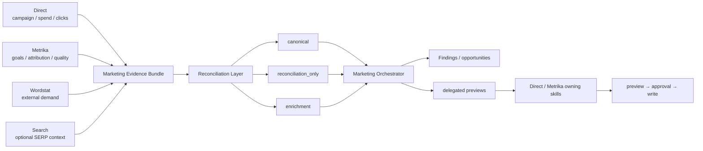

# Yandex Marketing

[Русский](README.md) · [**English**](README.en.md)

Version `1.1.0`. Read/analyze/recommend/preview cross-service paid-acquisition plugin over Direct, Metrika, Wordstat and optional Search. It has no Yandex credentials or HTTP clients.

> `DOCS 1.0.0` changes documentation only.

Marketplace policy: the `.agents` entry uses `authentication: ON_USE` as schema-compatible deferred-auth metadata. For this transport-free plugin it means authentication is deferred to owning service plugins, not that Marketing owns a credential surface.

## Orchestration



Direct evidence is required for full acquisition analysis. Metrika and Wordstat are primary enrichments; Search is optional intent/competitive context. Missing Direct returns `routing_required` / `ROUTING_REQUIRED` rather than invented substitute facts.

## Capability matrix

| Capability | Read | Write | MCP/App | Bundled API | File fallback |
|---|---:|---:|---:|---:|---:|
| Direct/Metrika performance reconciliation | yes | no | via source plugins | no | yes |
| Wordstat demand coverage | yes | no | via source plugins | no | yes |
| Search-query intelligence | yes | delegated preview only | via source plugins | no | yes |
| Landing/conversion hypotheses | yes | no | via source plugins | no | yes |
| Budget/query/goal delegated actions | yes | approval in owning plugin | via source plugins | no | yes |

## Evidence contract 1.1.0

- `canonical` — source-of-truth record under repository policy;
- `reconciliation_only` — overlapping comparison evidence, never summed with canonical;
- `enrichment` — context that does not replace the canonical metric.

Generic `metric: demand` is forbidden. Money evidence without currency/VAT/period carries `MONEY_CONTEXT_UNKNOWN` and remains incomparable. Capped Wordstat associations propagate `WORDSTAT_ASSOCIATIONS_CAPPED`.

## Finding taxonomy

`IMPLEMENTED_FINDING_TYPES` contains only the nine deterministic classes actually produced locally. Future classes live in `DEFERRED_FINDING_TYPES`; unknown/deferred findings sort after implemented types with `UNKNOWN_OR_DEFERRED_TYPE`. `GOAL_ALIGNMENT_RISK` is accepted only as an approved external finding for narrow goal-change delegation. Dead `NEW_CAMPAIGN_CANDIDATE` routing is removed. The normative vocabulary-to-executable taxonomy mapping is defined by the current Marketing scripts/tests and repository production contracts; historical design specs may be consulted only as non-normative implementation context.

```bash
python -m unittest discover -s tests -v
python -m py_compile scripts/marketing_prioritize.py
```
