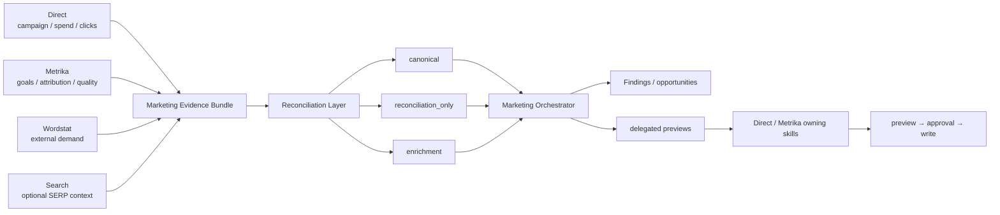

# Yandex Marketing

[**Русский**](README.md) · [English](README.en.md)

Версия `1.1.0`. Read/analyze/recommend/preview cross-service plugin для paid acquisition поверх Direct, Metrika, Wordstat и optional Search. Собственных Yandex credentials/HTTP clients нет.

> `DOCS 1.0.0` меняет только documentation layer.

Marketplace policy: `.agents` entry использует `authentication: ON_USE` как schema-compatible deferred-auth metadata. Для этого transport-free плагина это означает отложенную авторизацию в сервисных плагинах-владельцах, а не собственную credential surface.

## Оркестрация



Direct evidence обязателен для full acquisition analysis. Metrika и Wordstat — primary enrichments; Search — optional intent/competitive context. Missing Direct → `routing_required` / `ROUTING_REQUIRED`, а не substitute facts.

## Capability matrix

| Capability | Read | Write | MCP/App | Bundled API | File fallback |
|---|---:|---:|---:|---:|---:|
| Direct/Metrika performance reconciliation | yes | no | via source plugins | no | yes |
| Wordstat demand coverage | yes | no | via source plugins | no | yes |
| Search-query intelligence | yes | delegated preview only | via source plugins | no | yes |
| Landing/conversion hypotheses | yes | no | via source plugins | no | yes |
| Budget/query/goal delegated actions | yes | approval in owning plugin | via source plugins | no | yes |

## Evidence contract 1.1.0

- `canonical` — source-of-truth record по repository policy;
- `reconciliation_only` — overlapping comparison evidence, не складывается с canonical;
- `enrichment` — context, не заменяющий canonical metric.

Generic `metric: demand` запрещён. Money evidence без currency/VAT/period получает `MONEY_CONTEXT_UNKNOWN` и остаётся incomparable. Wordstat capped associations → `WORDSTAT_ASSOCIATIONS_CAPPED`.

## Finding taxonomy

`IMPLEMENTED_FINDING_TYPES` содержит только девять реально производимых deterministic classes. Future classes находятся в `DEFERRED_FINDING_TYPES`; unknown/deferred сортируются после implemented и получают `UNKNOWN_OR_DEFERRED_TYPE`. `GOAL_ALIGNMENT_RISK` допускается только как approved external finding для узкого goal-change delegation. Dead `NEW_CAMPAIGN_CANDIDATE` route отсутствует. Нормативное соответствие design vocabulary и executable taxonomy закреплено в `docs/superpowers/specs/2026-09-02-yandex-marketing-plugin-design.md`.

```bash
python -m unittest discover -s tests -v
python -m py_compile scripts/marketing_prioritize.py
```
