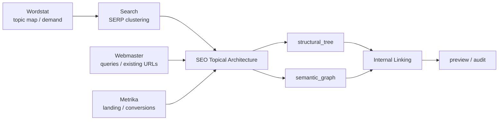

# Yandex SEO

[Русский](README.md) · [**English**](README.en.md)

Version `1.1.0`. Read-only cross-service orchestration over structured Wordstat, Search, Webmaster and Metrika outputs. The plugin **contains no Yandex API client/credentials and performs no live writes**.

> Phase 7 `1.1.0` adds Topical Architecture and Internal Linking while keeping Search the owner of SERP-overlap clustering and SEO transport-free.

Marketplace policy: the `.agents` entry uses `authentication: ON_USE` as schema-compatible deferred-auth metadata. For this transport-free plugin it means authentication is deferred to owning service plugins, not that SEO owns a credential surface.

## Orchestration



Service plugins own transport and API volatility. The SEO layer consumes structured evidence/artifacts while preserving provenance and limitations. **Search remains the owner of SERP-overlap clustering**; SEO does not add a competing fuzzy-text clusterer.

## Topical Architecture

`yandex-seo-topical-architecture` builds `seo-topical-architecture/v1` in `GREENFIELD` and `EXISTING_SITE` modes.

The artifact separates two layers:

- `structural_tree` — canonical navigation hierarchy with at most one `canonical_parent_id` per page;
- `semantic_graph` — independent semantic relations such as `SUPPORT`, `COMPARISON`, `EVIDENCE`, `USE_CASE`, and `BRIDGE`.

Page decisions: `PRESERVE`, `CREATE`, `EXPAND`, `MERGE`, `SPLIT`, `REDIRECT`, `SECTION_ONLY`, `BRIDGE`, `NO_PAGE`, `MANUAL_REVIEW`.

Evidence classes stay distinct: `OBSERVED`, `DERIVED`, `HYPOTHESIS`, `METHODOLOGY`. Semantic-cocoon / TGA / QBST methodology is not treated as a verified ranking mechanism. When Search evidence is unavailable, `SERP_VALIDATION_MISSING` is added and page boundaries remain hypotheses.

## Internal Linking

`yandex-seo-internal-linking` creates a **preview-only** link plan or audits an existing link inventory. Every recommendation records source/target, relation, user need, reason codes, evidence, confidence, and claim class.

Audit findings include `ORPHAN_PAGE`, `STRUCTURAL_PARENT_LINK_MISSING`, `MISSING_JUSTIFIED_LINK`, and `UNKNOWN_LINK_ENDPOINT`. Semantic cycles are not errors by themselves.

The plugin does not impose universal link counts, anchor density, or mandatory exact-match anchors, and it performs no CMS writes.

## Evidence contract

`SEO Evidence Bundle` requires explicit `site`, `analysis_period`, `search_region_id`. Period, geography, Search config and device context align independently. Metrika visitor geography never becomes a Search ranking region without evidence. Missing Webmaster impressions are not measured zero.

## Capability matrix

| Capability | Read | Write | MCP/App | Bundled API | File fallback |
|---|---:|---:|---:|---:|---:|
| Cross-service SEO audit / evidence bundle | yes | no | optional | pure-data | yes |
| Demand + visibility + SERP enrichment | yes | no | optional | pure-data | yes |
| Content gaps / cannibalization / CTR / conversion analysis | yes | no | optional | pure-data | yes |
| Topical Architecture / semantic cocoon | yes | no | optional | pure-data | yes |
| Internal-link plan / audit | yes | preview only | optional | pure-data | yes |
| Period / geo / search / device alignment | yes | no | optional | pure-data | yes |
| Technical finding action preview | yes | delegated preview only | optional | no transport | yes |
| Transparent finding prioritization | yes | delegated preview only | optional | pure-data | yes |

## Interpretation rules

Wordstat demand, Webmaster visibility, Search point-in-time context and Metrika visitor/conversion context are not interchangeable. Wordstat-only discovery ≠ validated page boundary; SERP presence ≠ market share; methodology ≠ ranking fact; there is no opaque universal SEO score.

```bash
python -m unittest discover -s tests -v
```
