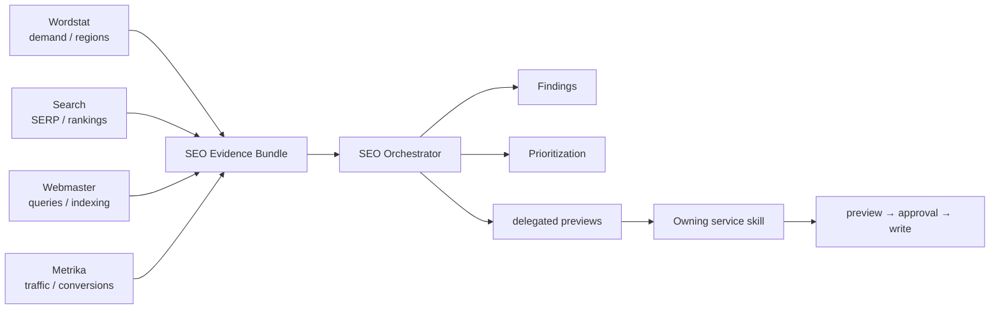

# Yandex SEO

[Русский](README.md) · [**English**](README.en.md)

Version `1.0.1`. Read-only cross-service orchestration over structured Wordstat, Search, Webmaster and Metrika outputs. The plugin **contains no Yandex API client/credentials and performs no live writes**.

> `DOCS 1.0.0` changes documentation only.

## Orchestration



Service plugins own transport and API volatility. The SEO layer aligns context, provenance and quality limitations, derives findings, and only delegates action previews to the owner.

## Evidence contract

`SEO Evidence Bundle` requires explicit `site`, `analysis_period`, `search_region_id`. Period, geography, Search config and device context align independently. Metrika visitor geography never becomes a Search ranking region without evidence. Missing Webmaster impressions are not measured zero.

## Capability matrix

| Capability | Read | Write | MCP/App | Bundled API | File fallback |
|---|---:|---:|---:|---:|---:|
| Cross-service SEO audit / evidence bundle | yes | no | optional | pure-data | yes |
| Demand + visibility + SERP enrichment | yes | no | optional | pure-data | yes |
| Content gaps / cannibalization / CTR / conversion analysis | yes | no | optional | pure-data | yes |
| Period / geo / search / device alignment | yes | no | optional | pure-data | yes |
| Technical finding action preview | yes | delegated preview only | optional | no transport | yes |
| Transparent finding prioritization | yes | delegated preview only | optional | pure-data | yes |

## Interpretation rules

Wordstat demand, Webmaster visibility, Search point-in-time context and Metrika visitor/conversion context are not interchangeable. Wordstat-only discovery ≠ validated content gap; SERP presence ≠ market share; there is no opaque universal SEO score.

```bash
python -m unittest discover -s tests -v
```
