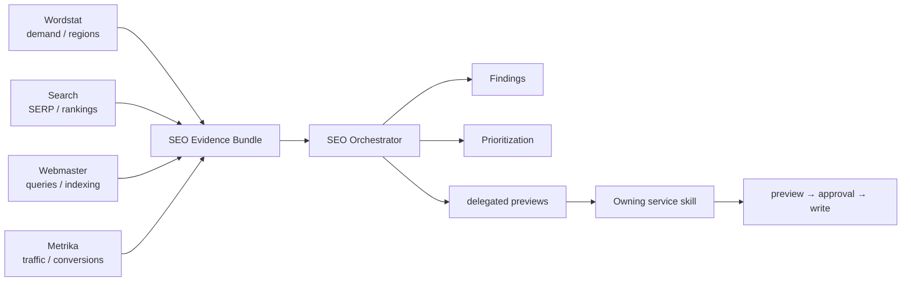

# Yandex SEO

[**Русский**](README.md) · [English](README.en.md)

Версия `1.0.1`. Read-only cross-service orchestration над structured outputs Wordstat, Search, Webmaster и Metrika. Плагин **не содержит Yandex API client/credentials и не выполняет live writes**.

> `DOCS 1.0.0` меняет только documentation layer.

## Оркестрация



Сервисные плагины владеют transport/API volatility. SEO слой выравнивает context, provenance и quality limitations, строит findings и только делегирует действия владельцу.

## Evidence contract

`SEO Evidence Bundle` требует explicit `site`, `analysis_period`, `search_region_id`. Period, geography, Search config и device context выравниваются независимо. Metrika visitor geography не становится Search ranking region без evidence. Missing Webmaster impressions не превращаются в measured zero.

## Capability matrix

| Capability | Read | Write | MCP/App | Bundled API | File fallback |
|---|---:|---:|---:|---:|---:|
| Cross-service SEO audit / evidence bundle | yes | no | optional | pure-data | yes |
| Demand + visibility + SERP enrichment | yes | no | optional | pure-data | yes |
| Content gaps / cannibalization / CTR / conversion analysis | yes | no | optional | pure-data | yes |
| Period / geo / search / device alignment | yes | no | optional | pure-data | yes |
| Technical finding action preview | yes | delegated preview only | optional | no transport | yes |
| Transparent finding prioritization | yes | delegated preview only | optional | pure-data | yes |

## Interpretation rules

Wordstat demand, Webmaster visibility, Search point-in-time context и Metrika visitor/conversion context не взаимозаменяемы. Wordstat-only discovery ≠ validated content gap; SERP competitor presence ≠ market share; нет opaque universal SEO score.

```bash
python -m unittest discover -s tests -v
```
