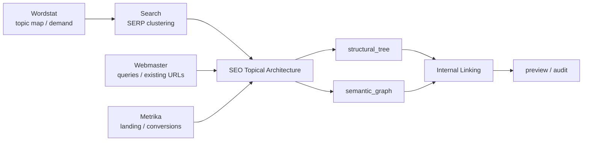

# Yandex SEO

[**Русский**](README.md) · [English](README.en.md)

Версия `1.0.1`. Read-only cross-service orchestration над structured outputs Wordstat, Search, Webmaster и Metrika. Плагин **не содержит Yandex API client/credentials и не выполняет live writes**.

> Phase 7 implementation добавляет Topical Architecture и Internal Linking; release version будет обновлена отдельно после полного contract/doc gate.

Marketplace policy: `.agents` entry использует `authentication: ON_USE` как schema-compatible deferred-auth metadata. Для этого transport-free плагина это означает отложенную авторизацию в сервисных плагинах-владельцах, а не собственную credential surface.

## Оркестрация



Service plugins владеют transport/API volatility. SEO слой принимает уже структурированные evidence/artifacts и сохраняет provenance/limitations. **Search остаётся владельцем SERP-overlap clustering**; SEO не добавляет второй fuzzy-text clusterer.

## Topical Architecture

`yandex-seo-topical-architecture` собирает `seo-topical-architecture/v1` в режимах `GREENFIELD` и `EXISTING_SITE`.

Артефакт разделён на два слоя:

- `structural_tree` — canonical navigation hierarchy, максимум один `canonical_parent_id` на страницу;
- `semantic_graph` — независимые смысловые отношения `SUPPORT`, `COMPARISON`, `EVIDENCE`, `USE_CASE`, `BRIDGE` и другие.

Page decisions: `PRESERVE`, `CREATE`, `EXPAND`, `MERGE`, `SPLIT`, `REDIRECT`, `SECTION_ONLY`, `BRIDGE`, `NO_PAGE`, `MANUAL_REVIEW`.

Evidence classes остаются раздельными: `OBSERVED`, `DERIVED`, `HYPOTHESIS`, `METHODOLOGY`. Методология semantic cocoon / TGA / QBST не считается подтверждённым ranking mechanism. При отсутствии Search evidence добавляется `SERP_VALIDATION_MISSING`, а границы страниц остаются гипотезами.

## Internal Linking

`yandex-seo-internal-linking` создаёт **preview-only** link plan либо аудитирует существующий link inventory. Каждая рекомендация содержит source/target, relation, user need, reason codes, evidence, confidence и claim class.

Audit findings включают `ORPHAN_PAGE`, `STRUCTURAL_PARENT_LINK_MISSING`, `MISSING_JUSTIFIED_LINK`, `UNKNOWN_LINK_ENDPOINT`. Semantic cycles сами по себе не считаются ошибками.

Плагин не задаёт универсальное количество ссылок, anchor density или обязательные exact-match anchors и не вносит изменения в CMS.

## Evidence contract

`SEO Evidence Bundle` требует explicit `site`, `analysis_period`, `search_region_id`. Period, geography, Search config и device context выравниваются независимо. Metrika visitor geography не становится Search ranking region без evidence. Missing Webmaster impressions не превращаются в measured zero.

## Capability matrix

| Capability | Read | Write | MCP/App | Bundled API | File fallback |
|---|---:|---:|---:|---:|---:|
| Cross-service SEO audit / evidence bundle | yes | no | optional | pure-data | yes |
| Demand + visibility + SERP enrichment | yes | no | optional | pure-data | yes |
| Content gaps / cannibalization / CTR / conversion analysis | yes | no | optional | pure-data | yes |
| Topical Architecture / semantic cocoon | yes | no | optional | pure-data | yes |
| Internal-link plan / audit | yes | preview only | optional | pure-data | yes |
| Period / geo / search / device alignment | yes | no | optional | pure-data | yes |
| Technical finding action preview | yes | delegated preview only | optional | no transport | yes |
| Transparent finding prioritization | yes | delegated preview only | optional | pure-data | yes |

## Interpretation rules

Wordstat demand, Webmaster visibility, Search point-in-time context и Metrika visitor/conversion context не взаимозаменяемы. Wordstat-only discovery ≠ validated page boundary; SERP competitor presence ≠ market share; methodology ≠ ranking fact; нет opaque universal SEO score.

```bash
python -m unittest discover -s tests -v
```
